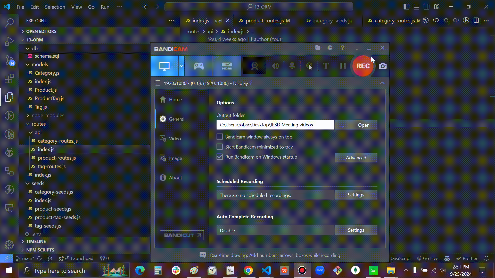

# E-Commerce Site

## Department Store

The motivation for this project was to practice making and connecting routes using
ORM paradigm. 

I learned how implementing the use of the following functions:

 creaing GET, POST, DELETE routes in ThunderClient.

## Table of Contents

1). Click on GIF video link as there is no front end.

## Usage

Github repository: 

Webpage GIF:

   

## Badges

